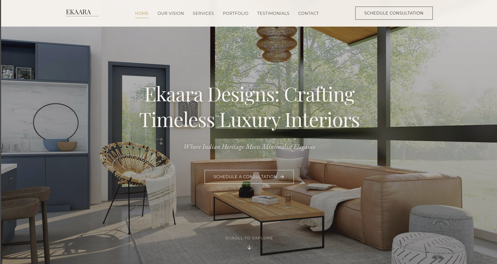
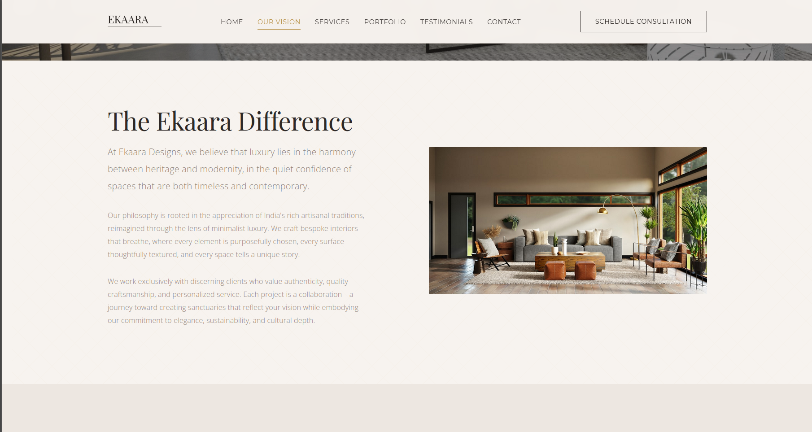
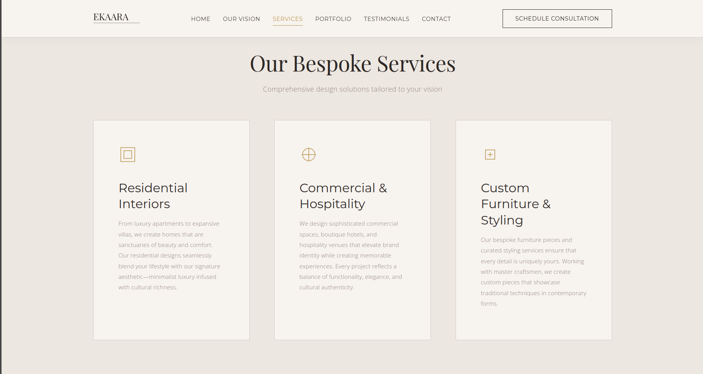
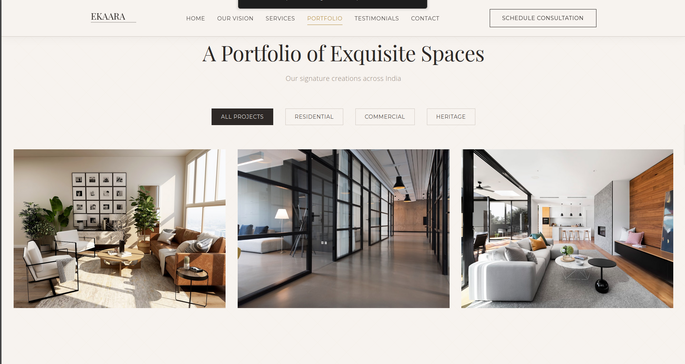
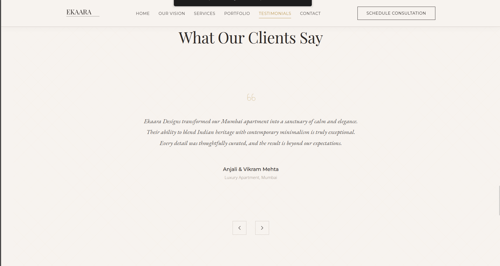

# Ekaara Designs - Luxury Interior Design Landing Page

A sophisticated, high-converting single-page website for a premium Indian interior design company. This project showcases bespoke, elegant, and culturally rich interior design services with a focus on minimalist luxury.

> **🚀 Live Demo:** [View Website](https://majestic-bubblegum-cbd9ce.netlify.app/)

> **🚀 Netlify Deployment Fixed!** If you encountered a "Page not found" error, check [`NETLIFY_FIX.md`](./NETLIFY_FIX.md) for the complete solution based on official Netlify documentation.

## 📸 Screenshots

### Hero Section

*Elegant hero section with parallax scrolling effect*

### Vision & About

*Our design philosophy and approach*

### Services

*Comprehensive luxury interior design services*

### Portfolio Gallery

*Filterable showcase of completed projects*

### Testimonials

*Real feedback from satisfied clients*

### Contact

*Get in touch with our design team*

## 🎨 Project Overview

**Brand Concept:** Ekaara Designs (Sanskrit: "unique" or "singular")

**Target Audience:** High-net-worth individuals, luxury homeowners, real estate developers, boutique hotel owners, and discerning clients who appreciate high-quality craftsmanship and refined aesthetics.

**Design Philosophy:** A seamless fusion of India's rich artisanal heritage with modern minimalist luxury, featuring clean lines, natural materials, and an unparalleled client experience.

## ✨ Features

### Design Elements
- **Hero Section:** Full-width, captivating imagery with parallax scrolling effect
- **Responsive Design:** Fully optimized for mobile, tablet, and desktop
- **Smooth Animations:** Scroll-triggered reveals and subtle micro-interactions
- **Portfolio Gallery:** Filterable project showcase with category sorting
- **Testimonial Carousel:** Auto-rotating client testimonials
- **Contact Form:** Functional form with validation
- **Sticky Navigation:** Elegant header with scroll behavior

### Technical Features
- Semantic HTML5 structure for SEO optimization
- CSS Grid and Flexbox for responsive layouts
- Vanilla JavaScript (no dependencies)
- Intersection Observer API for performance-optimized animations
- Mobile-first responsive design
- Accessibility enhancements (ARIA labels, keyboard navigation)
- Lazy loading for images
- Throttled scroll events for better performance

## 🎨 Color Palette

### Primary Neutrals
- **Ivory:** `#F7F3EF`
- **Cashmere:** `#EDE7E1`
- **Pebble:** `#D4CCC5`
- **Taupe:** `#B8ADA3`
- **Sable:** `#8B7E74`
- **Charcoal:** `#4A4543`
- **Deep Charcoal:** `#2D2826`

### Accent Colors
- **Emerald:** `#2C5F4F`
- **Sapphire:** `#1E3A5F`
- **Ruby:** `#6B2C2C`
- **Brass:** `#B8934A`
- **Antique Gold:** `#C9A961`
- **Copper:** `#B87333`

## 📝 Typography

- **Display Font:** Playfair Display (headings)
- **Primary Font:** Montserrat (navigation, labels)
- **Body Font:** Open Sans (body text)
- **Accent Font:** EB Garamond (testimonials, quotes)

## 🚀 Getting Started

### Prerequisites
- A modern web browser (Chrome, Firefox, Safari, Edge)
- A local web server (optional, for development)

### Installation

1. **Clone or download** this repository to your local machine

2. **Project Structure:**
```
Interior/
├── index.html
├── css/
│   └── styles.css
├── js/
│   └── main.js
├── assets/
│   └── images/
│       └── favicon.svg
└── README.md
```

3. **Open the project:**
   - Simply open `index.html` in your web browser
   - Or use a local server (recommended):
     ```bash
     # Using Python 3
     python -m http.server 8000
     
     # Using Node.js (with http-server)
     npx http-server
     ```

4. **View in browser:**
   - Navigate to `http://localhost:8000` (or the appropriate port)

## 📱 Responsive Breakpoints

- **Desktop:** 1025px and above
- **Tablet:** 768px to 1024px
- **Mobile:** Below 768px

## 🎯 SEO Optimization

### Implemented SEO Features:
- Semantic HTML5 structure
- Proper heading hierarchy (H1, H2, H3)
- Meta tags (title, description, keywords)
- Open Graph meta tags for social sharing
- Descriptive alt tags for all images
- Clean, readable URLs
- Fast loading times

### Primary Keywords:
- Luxury Interior Designer India
- Indian Interior Design Company
- Bespoke Interiors India
- Modern Indian Interior Design
- Minimalist Luxury Homes India

## 🎨 Customization

### Changing Colors
Edit the CSS variables in `css/styles.css`:
```css
:root {
    --color-ivory: #F7F3EF;
    --color-brass: #B8934A;
    /* ... more variables */
}
```

### Updating Content
All content is in `index.html`. Key sections:
- Hero section (line ~60)
- Vision/About (line ~120)
- Services (line ~150)
- Portfolio (line ~200)
- Testimonials (line ~300)
- Contact (line ~380)

### Modifying Animations
Animation settings are in `css/styles.css`:
```css
:root {
    --transition-smooth: all 0.4s cubic-bezier(0.4, 0, 0.2, 1);
    --transition-quick: all 0.2s ease-out;
}
```

## 📧 Contact Form Integration

The contact form currently logs data to the console. To integrate with a backend:

1. **Replace the form handler** in `js/main.js` (around line 280):
```javascript
fetch('/api/contact', {
    method: 'POST',
    headers: {
        'Content-Type': 'application/json',
    },
    body: JSON.stringify(data)
})
.then(response => response.json())
.then(data => {
    showFormMessage('Thank you!', 'success');
})
.catch(error => {
    showFormMessage('Error sending message', 'error');
});
```

2. **Popular integration options:**
   - [Formspree](https://formspree.io/)
   - [EmailJS](https://www.emailjs.com/)
   - [Netlify Forms](https://www.netlify.com/products/forms/)
   - Custom backend API

## 🌟 Performance Optimization

- **Lazy loading** for images
- **Throttled scroll events** (100ms for header, 16ms for parallax)
- **Intersection Observer** for scroll animations
- **CSS animations** instead of JavaScript where possible
- **Minimal dependencies** (vanilla JavaScript)

## 🔧 Browser Support

- Chrome/Edge: Latest 2 versions
- Firefox: Latest 2 versions
- Safari: Latest 2 versions
- Mobile browsers: iOS Safari 12+, Chrome Mobile

## 📄 License

This project is created as a design template. You are free to use, modify, and distribute it for personal or commercial projects.

## 🙏 Credits

### Fonts
- [Playfair Display](https://fonts.google.com/specimen/Playfair+Display) by Claus Eggers Sørensen
- [Montserrat](https://fonts.google.com/specimen/Montserrat) by Julieta Ulanovsky
- [Open Sans](https://fonts.google.com/specimen/Open+Sans) by Steve Matteson
- [EB Garamond](https://fonts.google.com/specimen/EB+Garamond) by Georg Duffner

### Images
- Placeholder images from [Unsplash](https://unsplash.com/)
  - Replace with actual project photography for production

## 📞 Support

For questions or support regarding this template:
- Create an issue in the repository
- Contact: hello@ekaaradesigns.com (example)

## 🚀 Deployment

### Deploy to Netlify
1. Push code to GitHub
2. Connect repository to Netlify
3. Deploy with default settings

### Deploy to Vercel
1. Install Vercel CLI: `npm i -g vercel`
2. Run: `vercel`
3. Follow prompts

### Deploy to GitHub Pages
1. Push code to GitHub
2. Go to Settings > Pages
3. Select branch and save

## 📝 Future Enhancements

- [ ] Add blog section for design insights
- [ ] Integrate CMS for easy content updates
- [ ] Add project detail pages
- [ ] Implement advanced filtering with URL parameters
- [ ] Add Google Analytics integration
- [ ] Create admin dashboard for inquiries
- [ ] Add multi-language support
- [ ] Implement dark mode option

---

**Built with ❤️ for Ekaara Designs**

*Crafting Timeless Luxury Interiors*
